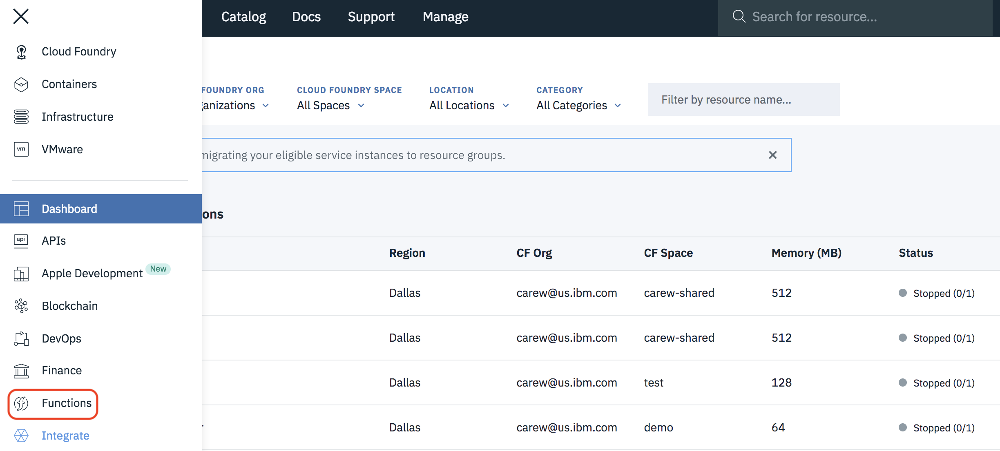
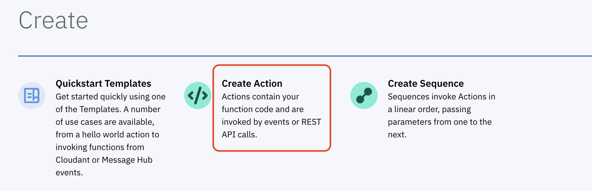
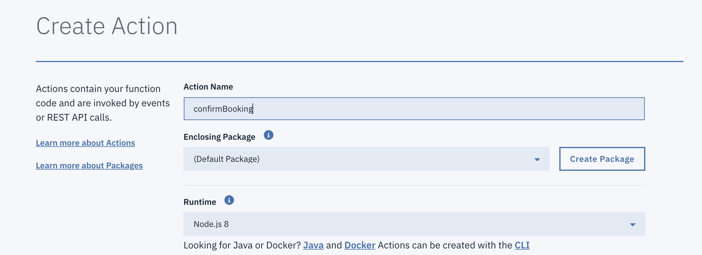
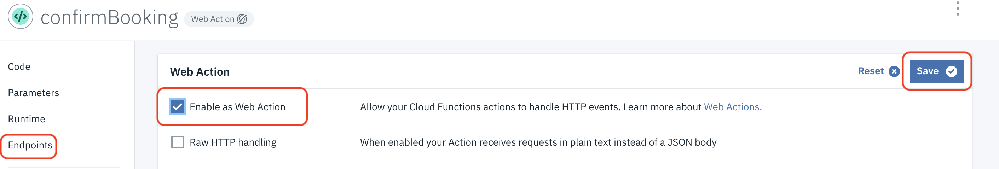
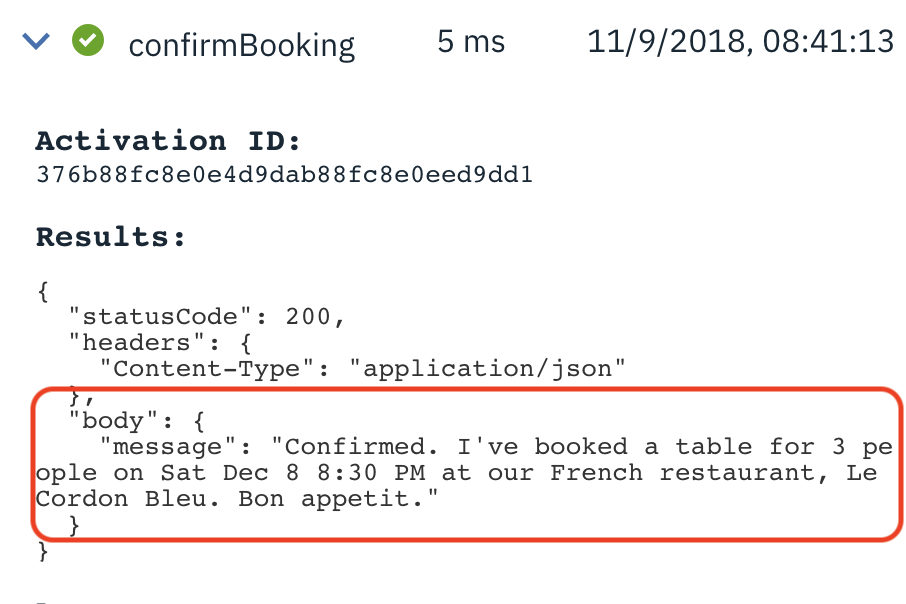
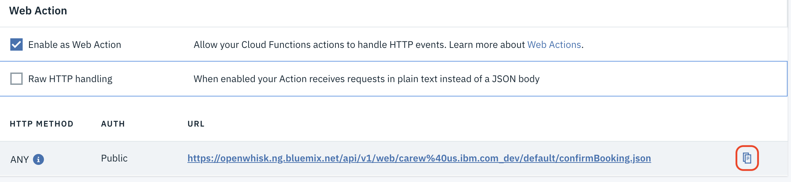
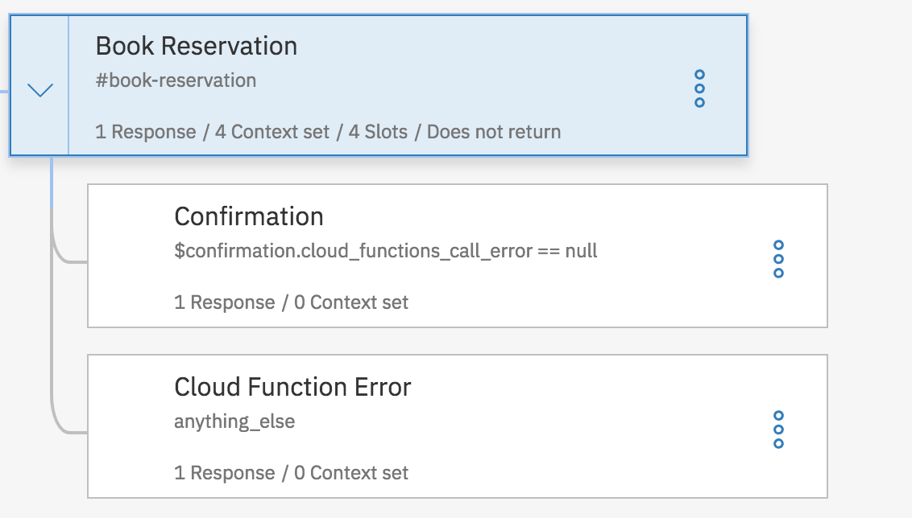
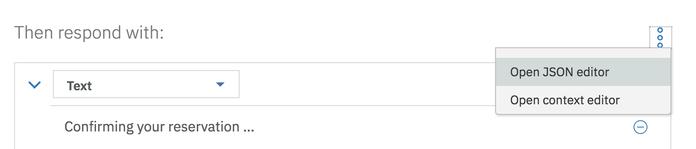
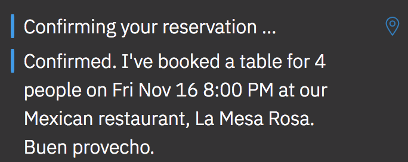

# Lab Extension - Call an IBM Cloud Function from a Dialog Node

We can extend our chatbot to include a third party call out. This is a common scenario where a chatbot might need to call an external service to gather information or fulfill its task. Examples might be anything from having the chatbot call a weather service to get the current weather for the user, or it might be kicking off a business process to complete the users request. The service call out can be implemented in a couple of ways, either an orchestrating application handles the integration or we can have a serverless cloud function call made directly from the Dialog in the chatbot. In this lab, we will demonstrate the latter.

## Step 1: Creating the IBM Cloud Function

The first step is create a Cloud Function. We've provided a simple one for you that would typically be used in a scenario like this to confirm the reservation once all the details are collected.  Our example just formats the  confirmation message to make it more user friendly but could easily be extended to do more.

1. Go to https://cloud.ibm.com and log in with  your IBM Cloud credentials

1. Click on the 3 line (hamburger) icon at the top left and select **Functions**

    

1. Click on **Start creating** and then click on **Create Action**

    

1. Name the action `confirmBooking`, keep the other default values and click **Create**

    

1. In a new browser tab copy the contents of the source file [confirm-booking.js](cloud-functions/confirm-booking.js) to your clipboard

1. Go back the Cloud Function editor and replace the default content of your new Cloud Function with the contents of the clipboard.

1. Click **Save**

1. In the navigation area on the left click on **Endpoints**. Select **Enable as Web Action** and then click **Save**

    

1. In the navigation area on the left click on **Code**. Click **Change Input** and replace the default input parameters with the following:

    `{"cuisine":"french","number": "3", "date":"2018-12-08","time":"20:30:00"}`

1. Click **Apply** and then click **Invoke** to test your cloud function. Verify that it returns a formatted message like the one shown below:

    

1. In the navigation area on the left click on **Endpoints**. Click on the icon to copy the URL of your cloud function to the clipboard

    

1. Open a text file and paste the URL into it.

### Step 2: Modifying DinnerBot to call the IBM Cloud Function

In this step you'll modify your dialog node that uses slots to call your cloud function to format the final conformation message shown to the user. You can't display the result of a cloud function call in the same node so we'll have to add a child node to display the result of the cloud function call. We also add a second child node to handle any errors returned from the call to the cloud function.

1. Go back to the Watson Assistant tool where you created the slots version of DinnerBot.

1. Select the **Dialog** tab and create 2 child nodes of the **Book Reservation**
 node with the following attributes:

    |  Node name   | If assistant recognizes | Then respond with          |
    |--------------|----------------------------------------------------|----------------------------|
    | Confirmation | $confirmation.cloud_functions_call_error == null | \<? $confirmation.body.message ?>|
    | Cloud Function Error | anything_else | IBM Cloud Function error:  \<? $confirmation.cloud_functions_call_error ?> |

    

1. Select the **Book Reservation**. Change the text in the section **Then respond with:** to `Confirming your reservation ...`

1. In the **And finally** section select **Jump to ...**  and then select the **Confirmation** node. Select the option **If assistant recognizes (condition)**

1. Click on the 3 dots to the right of **Then respond with:** and select **Open JSON editor** from the context menu

    

1. Paste the following code right before the final closing brace:

     ```
     ,
     "actions": [
    {
        "name":"changeme",
        "type":"web_action",
        "parameters": {
        "cuisine":"$cuisine",
        "date":"$date",
        "time":"$time",
        "number":"$number"
        },
        "result_variable": "$confirmation"
    }
    ]
    ```

1. Go to the text file where you saved your cloud function's URL and copy the part right after the prefix `https://openwhisk.ng.bluemix.net/api/v1/web` to the
clipboard. For example if your URL looks like this:

    `https://openwhisk.ng.bluemix.net/api/v1/web/johndoe_dev/default/confirmBooking.json`

    You would copy this:

    `/johndoe_dev/default/confirmBooking.json`

    > Note: Replace any "URL-safe" characters with the actual characters. For example, if your URL contains `%40`, replace with `@`.

1. Back in the Watson Assistant tool replace the value of the **name** attribute with the contents of the  clipboard. The added JSON should now look something like this:

    ```
    ,
    "actions": [
    {
        "name":"/johndoe_dev/default/confirmBooking.json",
        ...
    ```

### Step 3: Test the Cloud Function from the Watson Assistant test tool

1. In the Watson Assistant test tool click on the **Clear** link to start over. Type `Book a table for 4 mexican friday 8pm` when prompted.

1. Verify that you get a formatted confirmation message without being prompted for any input.  

    

## Summary

The Cloud Function integration enabled calling external services from within Watson Assistant so the logic in the driving application can be simplified significantly.
