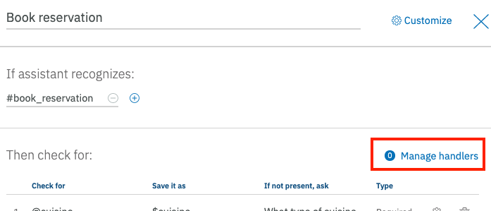

# Lab Extension - Enabling Digressions

We can extend our chatbot to allow for digressions from the "happy path". A digression occurs when a user is in the middle of a dialog flow that is designed to address one goal, and abruptly switches topics to initiate a dialog flow that is designed to address a different goal. With digression settings, you can allow the conversation to return to the dialog flow that was interrupted when the digression occurred. For example, the user might be ordering a new phone, but switches topics to ask about tablets. Your dialog can answer the question about tablets, and then bring the user back to where they left off in the process of ordering a phone. Allowing digressions to occur and return gives your users more control over the flow of the conversation at run time. They can change topics, follow a dialog flow about the unrelated topic to its end, and then return to where they were before.

In this extension you'll add a Digression to DinnerBot to allow the users to return restaurant hours wherever they are in the conversation flow. We will also add an extension to allow the user to exit the "happy path".

## Step 1: Add the restaurant hours dialog nodes

1. In the Watson Assistant tool, click on the Intents tab, click on the **`Create intent`** button to create a new intent.

1. Name the intent ***hours*** and click the **`Create intent`** button

1. Add the following example utterances in the **Add user example** section, clicking on **Add example** after entering each one

    ```
    When does it open for dinner ?
    When  does it close ?
    When does the chinese restaurant open for dinner ?
    When does La Mesa Rosa open for dinner ?
    When does the chinese restaurant close ?
    What are the hours of your restaurants
    What time is dinner ?
    When does La Mesa Rosa close 
    ```

1. Click the return arrow icon next to the intent name (*#hours*)

1. Click on the **Dialog** tab, select the **Book Reservation** node and click **Add node**

1. Name the node *Request Dinner Hours* and select the **#hours** intent where it says **if assistant recognizes**

1. Click on **Customize** in the top right corner. Select **Digressions**, expand **Digressions can come into this node**, enable it, and then select **Return after digression** Click **Apply**

    

1. Select the node **Request Dinner Hours** and click **Add child node**. Name the node *Restaurant set in context* and enter the context variable **$cuisine** where it says **If assistant recognizes**

1. Click on **Customize** in the top right corner and enable **Multiple responses**. Click **Apply**

1. Add the following values to the area labelled **Then respond with** clicking on **Add response** after each entry

    | If assistant recognizes       | Respond with                                                                       |
    |-------------------------------|------------------------------------------------------------------------------------|
    | $cuisine:chinese              | Our Chinese restaurant Hao Hao is open for dinner everyday from 6pm to 10pm        |
    | $cuisine:italian              | Our Italian restaurant Osteria is open for dinner Mon-Sat from 6pm to 10pm         |
    | $cuisine:mexican              | Our Mexican restaurant La Mesa Rosa is open for dinner Mon-Sat from 7pm to 10pm    |
    | $cuisine:french               | Our French restaurant Le Cordon Bleu is open for dinner Mon-Sat from 7pm to 10pm   |
    | $cuisine:american             | Our American restaurant Hemmingway's is open for dinner everyday from 7pm to 10pm  |

    

1. Select the new node **Restaurant set in context**, click on the 3 dots on the right, and then select **Duplicate** from the context menu

    

1. Change the name of the new node to *Restaurant set in intent* and enter the entity **@cuisine** where it says **If assistant recognizes**

1. In the section labelled **Then respond with:** change the values under **If assistant recognizes** to use the entity **@cuisine** instead of the context variable **$cuisine** as shown below (note: the responses don't need to be changed)

    

1. Duplicate the node you just modified and name it *Restaurant not set*. Enter **anything_else** where it says **If assistant recognizes**.

1. Click on **Customize** in the top right corner. Enable slots and  select **Prompt for everything**. Click **Apply**

1. Add the following values to the area labelled **Then check for** for a single entry.

    | Check for   | Save it as  | If not present, ask                         |
    |-------------|-------------|---------------------------------------------|
    | @cuisine    | $hours_for  | Which restaurant do you want the hours for? |

1. Select the node **Request Dinner Hours**. Go to the section **And finally** and select **Skip user input**.

    

1. Select the node **Book Reservation**. Click on **Customize** in the top right corner. Select **Digressions**, expand **Digressions can go away from  this node**, enable it  and select **Only digress from slots to nodes that allow returns** Click **Apply**

    

## Step 2: Add an Exit Handler

A user might be using your bot, providing the information requested, and then decide they no longer wish to continue the flow. In our case, they may be in the middle of a reservation request and decide they no longer want to make the reservation. This is different from a digression in that they want to completely abandon the dialog flow. Watson Assistant slots has a built in feature called handlers for this very case.

1. In the Watson Assistant tool, click on the Intents tab, click on the **`Create intent`** button to create a new intent.

1. Name the intent ***cancel_request*** and click the **`Create intent`** button

1. Add the following example utterances in the **Add user example** section, clicking on **Add example** after entering each one

    ```
    I want to cancel
    cancel the request
    quit the flow
    stop the reservation
    nevermind
    cancel
    ```

1. Click the return arrow icon next to the intent name (*#cancel_request*)

1. Click on the **Dialog** tab, select the **Book Reservation** node and click **Manage handlers**

    

1. Under **If assistant recognizes**, Select **`#cancel_request`** and under **Respond with** enter **`Okay, cancelling your request.`**

    

1. Before moving on with the cancellation, we need to clear any values we may have already saved in the slots. **Click** on the gear icon next to the repond with value to open the handler details page.

1. **Click** on the three dots to the right of the `Then respond with` title and select the **`Open JSON editor`** option.

1. Copy the text below and replace the value in the editor

    ```JSON
    {
      "context": {
        "cuisine": null,
        "date": null,
        "time": null,
        "number": null,
        "user_cancel_request": true
      },
      "output": {
        "text": {
          "values": [
            "Okay, cancelling your request"
          ]
        }
      }
    }
    ```

    

1. In the `And finally` section, select the **`Skip to response`** option from the drop down.

    

1. Click the **`Back`** button to go back to the handler detail page.

1. Click the **`Save`** button to go back to the `Book reservation` node.

1. On the Book reservation node, click the **`Customize`** link.

    

1. Enable the `Multiple response` option and click the **`Apply`** button.

    

1. Click the **`Add response`** link in the `Then respond with` section and move it up to be the first response. You can do this by clicking on the numbers to show the up/down arrows. Enter **`$user_cancel_request`** as the `If assistant recognizes value` and a `Respond with` value of **`Okay. Cancelling the reservation request. Come back anytime !`**. Then enter 'true' for the second response (this is our default response to complete the reservation).

    

1. Click on the gear icon next to the 'user_cancel_request' response. In the details panel, Click the three dots and select **`Open context editor`**.

1. Enter **`user_cancel_request`** under Variable name and set the Value to **`false`**

    

1. Then in the `And finally` section, select the `Jump to` option from the drop down.

    

1. The tooling will show you the full dialog tree, select the **`Welcome`** node and in the subsequent screen, select the **`Wait for user input`** option.

    

    

1. Click the 'Save' button to go back to the 'Book Reservation' node

    

## Step 3: Test your chatbot

The Watson Assistant tooling offers a testing panel to test phrases to confirm the correct intents, entities, and dialog are matched and returned.

1. To test the bot, click on the **Try it** icon in the top-right corner of the tooling.

1. A side panel appears and shows the contents of the node that matches welcome. Enter a message that triggers the #hours intent. Start with  `what time does dinner start ?`

1. Verify that you're prompted for a restaurant.

    

1. Enter `Hao Hao` or `chinese` and verify that the hours for the chinese restaurant are returned.

1. Click on the **Clear** link to start over with the test tool.  Type `When is dinner at the chinese restaurant` when prompted.

1. Verify that the hours for Hao Hao are returned

1. Now you'll test a digression. Click on the **Clear** link to start over with the test tool.  Type `Book a table for 4 mexican next friday ` when prompted.

1. Verify that you are prompted for the time. Instead of the time enter `what are the hours` instead

1. Verify that the hours of the  Mexican restaurant are returned and you're prompted for the time of your reservation again.

    

# Summary

Pat yourself on the back. You've seen how digressions can be used to seamlessly handle certain types of user input at any point in the dialog flow, as well as how handlers can be added to a slot to allow for slot specific digressions.
