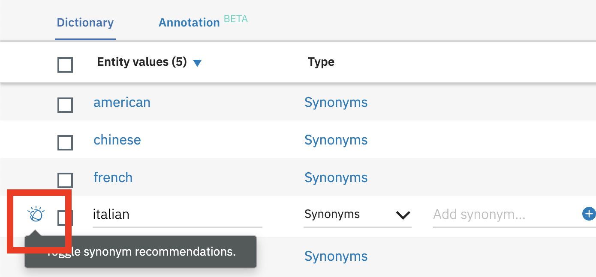
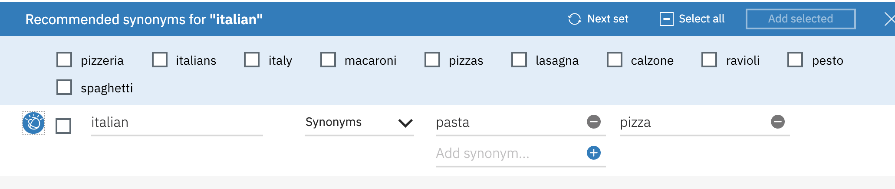
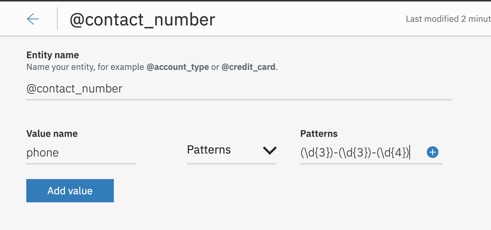
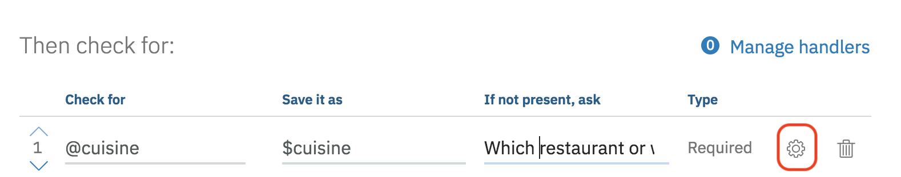
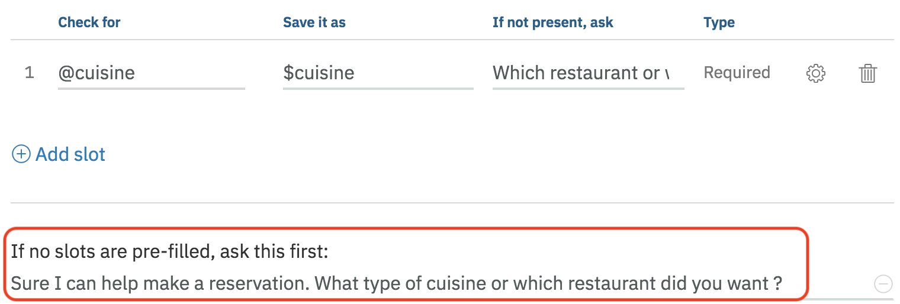
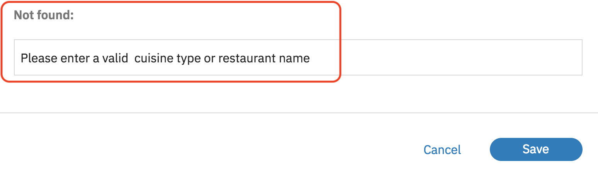
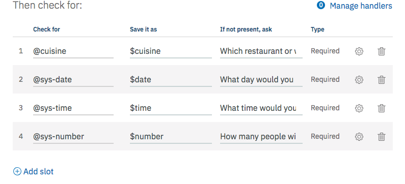
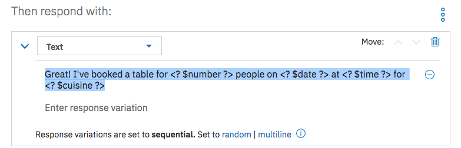

# Introduction to Watson Assistant

This lab will walk you through building a conversational system using the Watson Assistant service. The lab is structured to build a basic "bot" with optional sections to extend the bots capabilities.

## Overview

Watson Assistant service combines machine learning, natural language understanding, and integrated dialog tools to create conversation flows between your apps and your users.

## Step 1: Designing Your Bot

In this section, we will design the interaction between a user and a chatbot named DinnerBot that handles dinner reservations for guests at an all inclusive resort that has several restaurants.

It might help to think of the chatbot as an automated version of an existing agent, such as a customer service agent. Training a chatbot is like training a human agent. You will train the chatbot with the knowledge of certain tasks (intents) and things that these tasks interact with (entities). These components are then combined to create a dialog tree that can take one or more paths to respond to the user's request.

+ It can be helpful to take a snapshot of an existing dialogue and then break it down into intents and entities.For example, one thing we noticed is that some people identify the restaurant by cuisine type, not by name so the bot needs to handle that.

  | Example                                                          |
  | ---------------------------------------------------------------- |
  | Bot: Hi, I'm DinnerBot. You can ask me to reserve a table        |
  | Dave: I want to book a table. 	                                 |
  | Bot: Sure, I can make a reservation for you. Which restaurant or what type of cuisine would you like ? |
  | Dave: I would like Mexican food                                  |
  | Bot: What day ?                                                  |
  | Dave: Friday please                                              |
  | Bot: What time on Friday ?                                       |
  | Dave: 8:00 pm                                                    |
  | Bot: How many people will be coming ?                            |
  | Dave: 5                                                          |
  | Bot: Excellent ! Here are the details of your booking            |

+ In order to understand the action a user is wanting the bot to perform. We will look for the variations in which the user may "ask" for this action.

  | Example                                                          |
  | ---------------------------------------------------------------- |
  | Intent: book a reservation                                       |
  | Variations                                                       |
  | 1. Reserve a table                                               |
  | 2. Book a reservation                                            |
  | 3. Make a reservation                                            |
  | 4. Secure a reservation                                          |
  | 5. Schedule a reservation                                        |
  | Label: #book_reservation                                         |

+ To fulfill the users request, we may need to recognize the important objects in the request (referred to as entities). This example reservation system can differentiate different types of cuisine and/or restaurant names.

  | Example                                       |
  | ----------------------------------------------|
  | Entity: type of cuisine/restaurant name       |

  | Cuisine type     | Restaurant name    |
  |------------------|--------------------|
  | 1. Mexican       | La Mesa Rosa       |
  | 2. Chinese       | Hao Hao            |
  | 3. American      | Hemmingways        |
  | 4. Italian       | Osteria            |
  | 5. French        | Le Cordon Bleu     |
  | Label: @cuisine  |                    |

In the Dialog editor of Watson Assistant, we can now setup logic to step the user through the conversation. In the next section, we will use this design to train the Watson Assistant service.

## Step 2: Build Your Bot Using Watson Assistant Service

Now that we have designed the first dialogue between the chatbot and the user, we can train the Watson Assistant service.

1. Go to the IBM Cloud Console - (https://cloud.ibm.com) and log in.

1. Click on the **`Create resource`** button at the top-right corner of the IBM Cloud dashboard.

1. Click on the **AI** category on the left panel and then Select the **Watson Assistant** tile

    

1. Click the **`Create`** button (*Leave default options for Lite plan, region service name, etc*).

1. Click on the  **`Launch tool`** button to launch into the Watson Assistant tooling.

    

1. This is the Watson Assistant tooling where you can create skills with the training data and machine learning logic that enable your chat bot to understand and help customers.  Click on **`Skills`** and then on  **`Create Skill`** button

    

1. Enter **DinnerBot** as the  name for the skill and click the **`Create dialog skill`** button

1. You will be redirected into a page with several tabs (Intents, Entities, Dialog, etc). Under the Intents tab, click on the **`Create intent`** button to create the first intent.

1. Name the intent ***book_reservation*** and click the **`Create intent`** button

1. Add the following example utterances in the **Add user example** section, clicking on **Add example** after entering each one

    ```
    book a reservation
    book a table
    make a reservation
    reserve a table
    schedule a reservation
    secure a reservation
    ```

    

1. Click the return arrow icon next to the intent name (*#book_reservation*)

    

1. Click on the **Entities** tab in the top menu bar. This is where you can add entities, in our use case we want to capture where the reservation will be made. Click the **`Create entity`** button

1. Name the entity ***cuisine*** and click the **`Create entity`** button. Then add the following values and synonyms (the restaurant name) clicking **Add value** after entering each one

    ```
    american
    chinese
    italian
    mediterranean
    mexican
    ```

    

1. [Optional] Feel free to experiment with the entity recommendation feature. This feature will suggest other synonyms similar to the ones in your given entity list. For example, if you bring up the recommendations for the entity value *italian* (by clicking the icon next to the entity vaue) when there are no other synonyms, you will see one list of recommendations. If you add the synonyms: pasta and pizza to the list and then bring up the recommendations again, you will see a different list.

    

    

1. Click the return arrow icon next to the entity name (*@cuisine*)

1. We will create one more user defined entity to capture the phone number for the reservation. Click the **`Create entity`** button

1. Name the entity ***contact_number*** and click the **`Create entity`** button. Then give the value name 'phone', switch the type from 'Synonyms' to 'Pattern' in the drop down list add finally use the pattern: **(\d{3})-(\d{3})-(\d{4})**. Then click the **Add value** button.

    

1. Click the return arrow icon next to the entity name (*@contact_number*)

1. Watson Assistant has a handful of common entities created by IBM that can be used across any use case. These entities include: date, time, currency, percentage, and numbers. For our use case, we want to capture the date and time of the reservation as well as the number of people in the party. Click on **System entities** and enable **@sys-date**, **@sys-number** and **@sys_time**

    

1. Click on the **Dialog** tab in the top menu bar. Click **Create**. There are two nodes added by default. The welcome condition is triggered when the chatbot is initially started. This is a good place to introduce the bot and suggest actions the user can ask of this chatbot. Select the **Welcome** node and change the default response to:

    `Hi. I'm DinnerBot. You can ask me to reserve a table for dinner.`

    

1. The second node checks for the condition **anything_else**. In the event the user enters something that wasn't expected, the service will return this response. Ideally, it should convey a way for the user to recover, such as example phrases. For this exercise we'll stick with the defaults to save time.

    

1. To handle the actual reservation request, we will be using a feature called *Slots*. The slots feature allows you to collect multiple pieces of information in a single Dialog node allowing users to provide  some or all of the required information when interacting with your bot. For example if a user enters `Book a table` they will be prompted  in sequence for all  the information needed. However if a user enters `Book a table for Chinese food next Friday at 8pm` the bot will only ask for the number of people dining before confirming the reservation.

1. Select the **Welcome** node again and click **Add node**

1. Name the node ***Book Reservation*** and select the *#book_reservation intent* where it says **if assistant recognizes**

1. Click on **Customize** in the top right corner. Select **Enable Slots** and **Prompt for everything**. Click **Apply**

    

1. Add the first slot by entering `@cuisine`,  in the column labeled **Check for**, `$cuisine` in the **Save it as** column and the  prompt `Which restaurant or what type of cuisine would you like?` in the **If not present, ask** column

    

1. Enter `Sure I can help make a reservation. What type of cuisine or which restaurant did you want?` in the field with label **If no slots are pre-filled, ask this first**

    

1. Click on the gear icon next to the added slot to add the error handling that was implemented in the original version. Scroll down to the field with label **Not found** and enter `Please enter a valid  cuisine type or restaurant name`
Click **Save**

    

1. Add the following slots one by one by clicking on  **Add slot** prior to adding each one. Remember that you'll need to click on the gear icon next to a slot to add in the  message in the **Not Found** field for that slot.

    | Check for        | Save it as   | If not present ask                    | Not found                       |
    |------------------|--------------|---------------------------------------|---------------------------------|
    | @sys-date        | $date        | What day would you like to reserve ?  | Please enter a valid date       |
    | @sys-time        | $time        | What time would you like to reserve ? | Please enter a valid time       |
    | @sys-number      | $number      | How many people will be dining?      | Please enter a valid party size  |
    | @contact_number  | $contact_number      | What is your contact number?      | Please enter a valid phone number  |

    

1. Add `Great! I've booked a table for <? $number ?> people on <? $date ?> at <? $time ?> for <? $cuisine ?>` to field with label **Then respond with:**

    

## Step 3: Test Watson Assistant Service

The Watson Assistant tooling offers a testing panel to test phrases to confirm the correct intents, entities, and dialog are matched and returned.

1. To test the bot, click on the **Try it** icon in the top-right corner of the tooling.

    

1. A side panel appears and shows the contents of the node that matches welcome. Enter a message that triggers the #book_reservation intent. We can ask *book a table*

    

1. Notice that the intent #book_reservation was recognized. The #book_reservation node was triggered and the output includes the response from slots in the node.

      

1. Follow the rest of the prompts to complete the reservation request.

1. Click on the **Clear** link to start over with the test tool.  Type `Book a table at the italian place for 4 on friday at 8pm` when prompted.

1. Verify that you get a confirmation message without being prompted for any input (if you have the contact number as optional).

## Step 4: Extend the bot

There is so much functionality in Watson Assistant that it is hard to cover it all in one lab. Feel free to go through the Watson Assistant documentation to understand other features and extend this bot. A couple of example extension you could complete are:

+ [Add digressions and handlers to this bot](DigressionAndHandlersExtension.md).
+ [Add Cloud Functions to make an external service call](CloudFunctionsExtension.md).

# Summary

The Watson Assistant service was able to handle gathering multiple pieces of information, parsing the user input, and placing the values into a context that was used to inject into the response back to the user.  

**Take a bow ! You've written a working chatbot from scratch !**

# Links

* [IBM Watson Assistant Docs](https://console.bluemix.net/docs/services/conversation/dialog-build.html#dialog-build)
* [Blog for IBM Watson Assistant Slots Code Pattern](https://developer.ibm.com/code/2017/09/19/managing-resources-efficiently-watson-conversation-slots/)