# Introduction to Watson Assistant

## Lab 1 - Building a bot from scratch

## Overview

Watson Assistant service combines machine learning, natural language understanding, and integrated dialog tools to create conversation flows between your apps and your users. In this lab, you will create a workspace and understand the terminology of creating a chatbot.

### Step 1: Designing Your Bot

Building a chatbot with Watson Assistant is so easy, some developers choose to dive right into the tooling. However, with a well-thought out, well-planned chatbot, the interaction with the user can lead to a much better experience that can handle edge cases. In this section, we will design the interaction between a user, Dave, and a chatbot named DinnerBot that handles reservations  for guests at an all inclusive resort that has several restaurants.

A good question to ask yourself is, "Who is my user and what problem do they have?" Expand on the user's profile by determining what the user needs from this chatbot. Does the user have a need to book a reservation at a restaurant? Or an answer to a common question like "Where's the bathroom?" at a conference. Maybe a chatbot that handles tasks like turning on lights or other equipment. It might help to think of the chatbot as an automated version of an existing agent, such as a customer service agent. Look at existing processes that include repeated manual processes, which can sometimes be augmented with chatbots.

Training a chatbot is like training a human agent. You will train the chatbot with the knowledge of certain tasks (intents) and things that these tasks interact with (entities). These components are then combined to create a dialog tree that can take one or more paths to respond to the user's request.

In the following steps, we have provided a sample restaurant chatbot that handles dinner reservations for the restaurants at an all-inclusive resort.

1. Envision the user that interacts with the bot.

  | Example                                                 |
  | ------------------------------------------------------- |
  | A user needs to book a table at one of the restaurants  |

2. Now, let's describe the overall function of the chatbot.

  | Example                                                                     |
  | --------------------------------------------------------------------------- |
  | The chatbot helps users book reservations at one of the resorts restaurants |

3. It can be helpful to take a snapshot of an existing dialogue and then break it down into intents and entities. One thing we noticed is that some people identify the restaurant by cuisine type, not by name so the bot needs to handle that. A sample conversation is shown below. Keep the conversation simple…you can always add more complex logic later.

  | Example                                                          |
  | ---------------------------------------------------------------- |
  | Bot: Hi, I'm DinnerBot. You can ask to reserve a table.          |
  | Dave: I want to book a table. 	                                 |
  | Bot: What restaurant or type of cuisine would you like?          |
  | Dave: I would like Mexican food                                  |
  | Bot: What day ?                                                  |
  | Dave: Friday please                                              |
  | Bot: What time on Friday ?                                       |
  | Dave: 8:00 pm                                                    |
  | Bot: How many people will be coming ?                            |
  | Dave: 5                                                          |
  | Bot: Excellent ! Here are the details of your booking            |

4. Let's start with the action the user wants to do, which is referred to as an intent. First  we write a human-friendly description of the action the user is wanting to perform. Then we list at least five ways the user might phrase this action. Lastly, add a label, like a variable name in code (alpha-numeric, underscores, etc.), that can be used later as a reference.

  | Example                                                          |
  | ---------------------------------------------------------------- |
  | Intent: book a reservation                                       |
  | Variations                                                       |
  | 1. Reserve a table                                               |
  | 2. Book a reservation                                            |
  | 3. Make a reservation                                            |
  | 4. Secure a reservation                                          |
  | 5. Schedule a reservation                                        |
  | Label: #book_reservation                                         |

  If you find that you don't have many variations, invite a colleague, a friend (or a real user!) to suggest how they would ask "to book a reservation." In the real world, you could use customer interactions as a base of inspiration.

5. Another component to training a chatbot is recognizing objects, which are referred to as entities. This example reservation system can differentiate different types of cuisine and/or restaurant names. We add a type of cuisine to booking a reservation.

  | Example                                       |
  | ----------------------------------------------|
  | Entity: type of cuisine/restaurant name       |

  | Cuisine type     | Restaurant name    |
  |------------------|--------------------|
  | 1. Mexican       | La Mesa Rosa       |      
  | 2. Chinese       | Hao Hao            |
  | 3. American      | Hemmingways        |               
  | 4. Italian       | Osteria            |
  | 5. French        | Le Cordon Bleu     |
  | Label: @cuisine  |                    |

 We could add time and number entities, however, there are some built-in system entities provided by IBM, like numbers, dates, and times, that the DinnerBot will use.

In the Dialog editor of Watson Assistant, we can now setup logic to step the user through the conversation. In the next section, we will use this design to train the Watson Assistant service.

### Step 2: Train Watson Assistant Service

Now that we have designed the first dialogue between the chatbot and the user, we can train the Watson Assistant service. Sign up for an IBM Cloud account at bluemix.net. If you already have an account, sign into your account.

1. Click on ***Create resource***  at the top-right corner of the IBM Cloud dashboard.

2. Select the **Watson Assistant** tile under the section titled **AI**

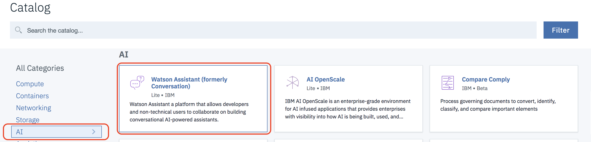

3. Click **Create**

4. Click on the  **Launch tool** button to launch into the Watson Assistant tooling.

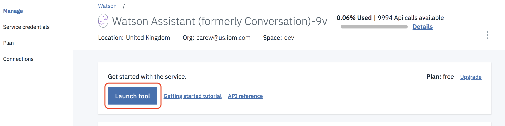

5. This is the Watson Assistant tooling where you can create skills with the training data and machine learning logic that enable your chat bot to understand and help customers.  Click on **Skills** and then on  **Create new**

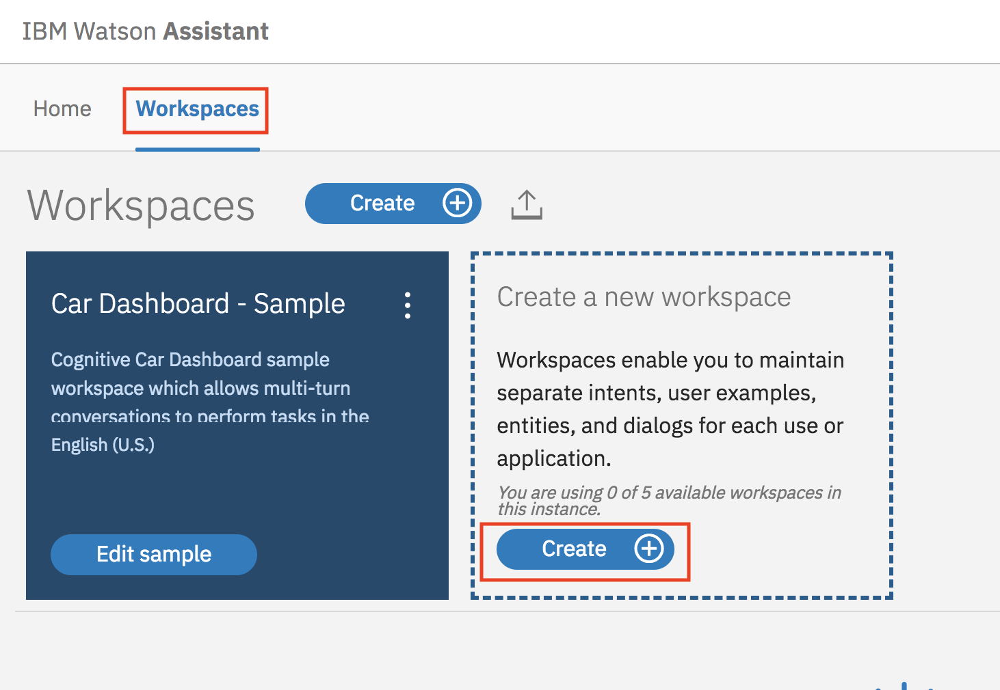

6. Enter **DinnerBot**  as the  name for the chatbot and click **Create**

7. You will be redirected into a page with three tabs, Intents, Entities, and Dialog. Under the Intents tab, click on **Add intent**  to create the first intent.

8. Name the intent *#book_reservation* and click **Create intent**

9. Add the following examples clicking on **Add example** after entering each one

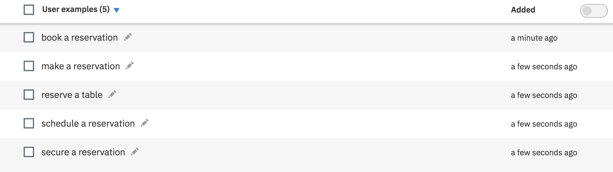

10. Click on the return icon to go back to the main menu screen

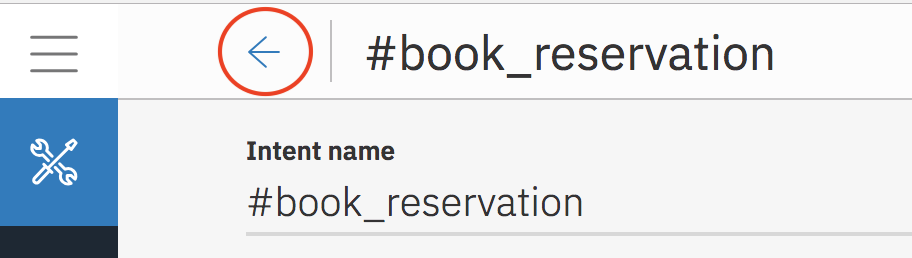

11. Click on the **Entities** tab in the top menu bar. This is where you can add entities. Click **Add entity**

12. Name the entity *@cuisine*, click **Create entity** and then add the following values and synonyms clicking **Add value** after entering each one

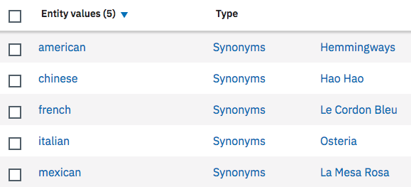

13. Click in the return icon to go back to the main menu screen

14. The Watson Assistant has a handful of common entities created by IBM that can be used across any use case. These entities include: date, time, currency, percentage, and numbers. Click on **System entities** and enable @sys-date, @sys-number and @sys_time

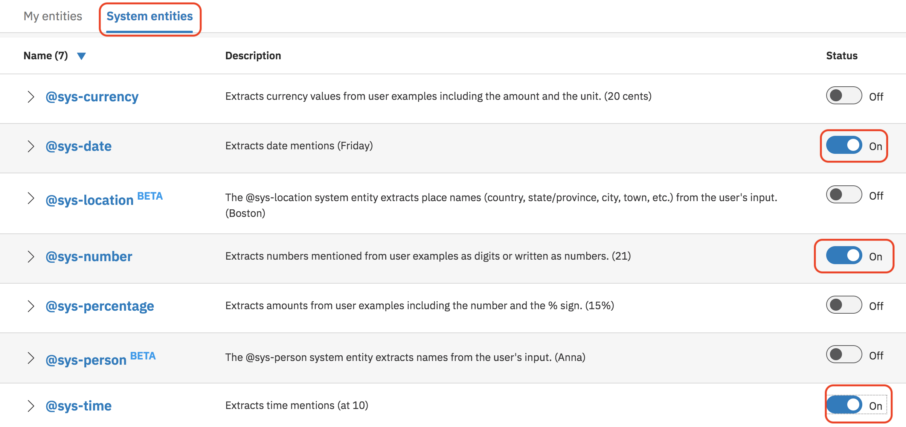

15. Click on the **Dialog** tab in the top menu bar. Click **Create**. There are two nodes added by default. The welcome condition is triggered when the chatbot is initially started. This is a good place to introduce the bot and suggest actions the user can ask of this chatbot. Select the **Welcome** node and change the default response to:

`Hi. I'm DinnerBot. You can ask to reserve a table at any of our restaurants by cuisine type or restaurant name`

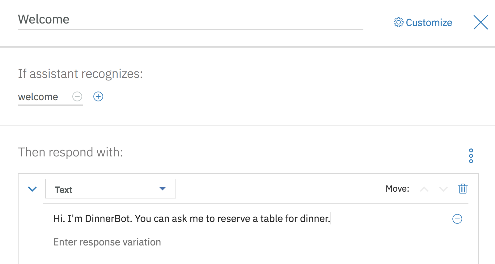

16. The second node checks for the condition **anything_else**. In the event the user enters something that wasn't expected, the service will return this response. Ideally, it should convey a way for the user to recover, such as example phrases. For this exercise we'll stick with the defaults to save time.

17. Select the **Welcome** node again and click **Add node**

18. Name the node **Cuisine** and select the **#book-reservation intent** where it says **if assistant recognizes** and enter `What restaurant or what type of cuisine would you like ?` as the response

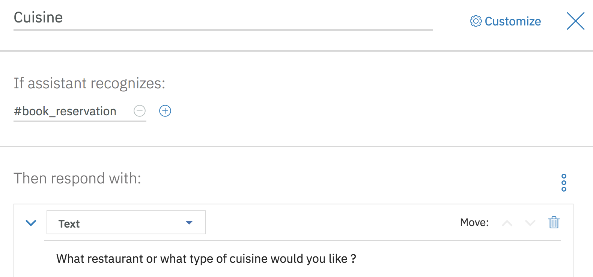

19. Select the **Cuisine** node again and click **Add child node**. Name the node **Date of reservation** and select the `@cuisine` entity where it says  **if assistant recognizes**.

20. Click on the 3 dots to the right of where is says **Then respond with:** and select **Open context editor**. Set a content variable **$cuisine** to the value of the entity `@cuisine` and change the response text to `What day would you like to reserve ?`

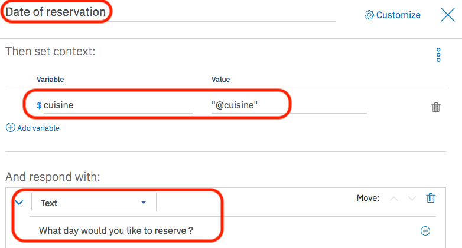

21. Select the **Cuisine** node again and click **Add child node**. Name the node **Invalid cuisine** and select  `anything_else` where it says  **if assistant recognizes**. Set the response text to `Please enter a valid cuisine type or restaurant name`

22. Scroll down to where it says **And finally** and select  **Jump to...** Select the **Date of reservation** node and then select **Wait for user input**. Note this loops  prevents  the user from continuing until they enter a valid cuisine or restaurant name.

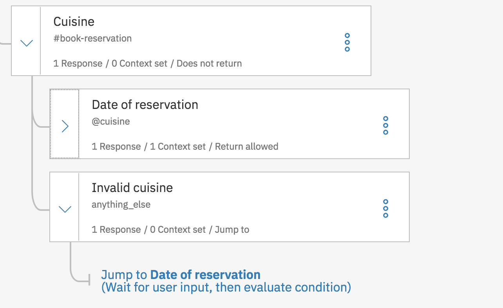

23. Add 2 child nodes to the node **Date of reservation** with the following settings:

| Name                | Trigger       | Response                   | Context var       | And finally                 |
| --------------------|---------------|----------------------------|-------------------|-----------------------------|
| Time of reservation | @sys-date     | What time would you like ? | $date = @sys-date | Wait for user input         |
| Invalid date        | anything_else | Please enter a valid date  |                   | Jump to Time of Reservation |

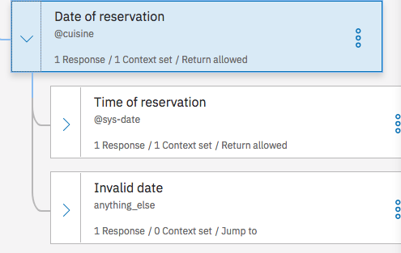

24. Add 2 child nodes to the node **Time of reservation** with the following settings:

| Name                | Trigger       | Response                   | Context var       | And finally                 |
| --------------------|---------------|----------------------------|-------------------|-----------------------------|
| Size of party       | @sys-time     | How many in your party ?   | $time = @sys-time | Wait for user input         |
| Invalid time        | anything_else | Please enter a valid time  |                   | Jump to Size of party       |

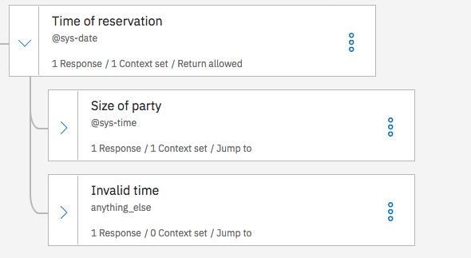

25. Add 2 child nodes to the node **Size of party** with the following settings:

| Name                | Trigger       | Response                   | Context var       | And finally                 |
| --------------------|---------------|----------------------------|-----------------  | ----------------------------|
| Confirm reservation | @sys-number   | Great! I've booked a table for `<? @sys-number ?>` people on `<? $date ?>` at `<? $time ?>` for `<? $cuisine ?>` | $number = @sys-number | Wait for user input         |
| Invalid party size  | anything_else | Enter a valid party size   |       | Jump to Confirm reservation |

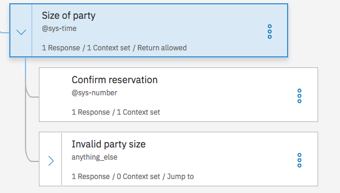

26. Select the **Size of party node** Scroll down to where it says **And finally** and select  **Jump to...** Select the **Confirm reservation** node and then select **Wait for user input**.

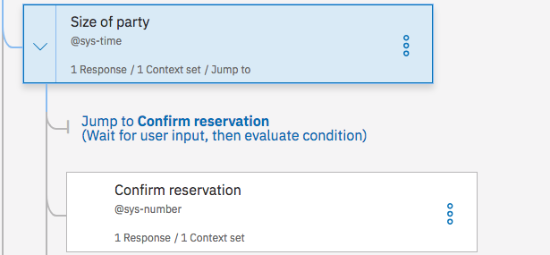

### Step 3: Test Watson Assistant Service

The Watson Assistant tooling offers a testing panel to test phrases to confirm the correct intents, entities, and dialog are matched and returned.

1. To test the bot, click on the **Try it** icon in the top-right corner of the tooling.

2. A side panel appears and shows the contents of the node that matches welcome. Enter a message that triggers the #book_reservation intent. We can ask *book a table*

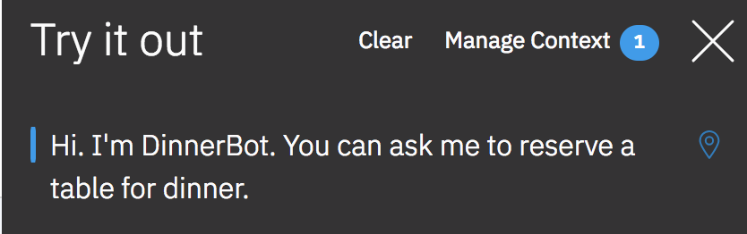

3. Notice that the intent #book_reservation was recognized. The #book_reservation node was triggered and the output includes the response from the Book Reservation node. The user is prompted for a choice of cuisine.

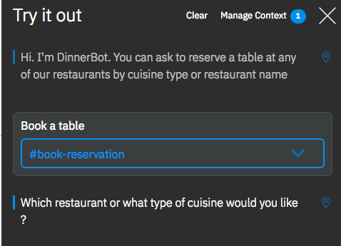  

4. When the user enters a cuisine or restaurant name, the @cuisine entity is recognized.

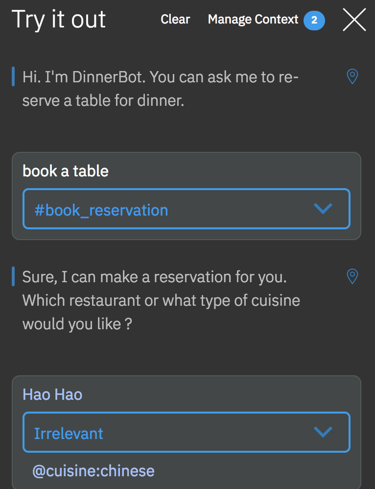  

5. Test out your bot by giving it the expected input until you get to the confirmation message.

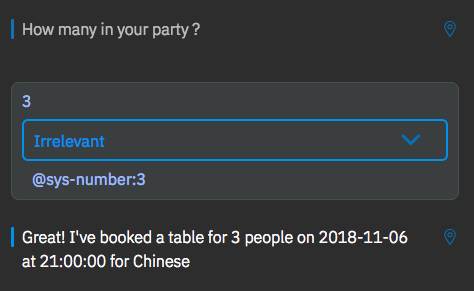  

6. Click on the **Clear** link to start over with the test tool. Try entering invalid input at various stages to see if the bot responds as expected.

7. Take a bow ! You've written a working chatbot from scratch !

## Summary

The Watson Assistant service was able to handle gathering multiple pieces of information, parsing the user input, and placing the values into a context that was used to inject into the response back to the user. In a future lab you'll see how chatbots like this that always ask a fixed set of questions are much  easier  to write when the Slots feature is used.
